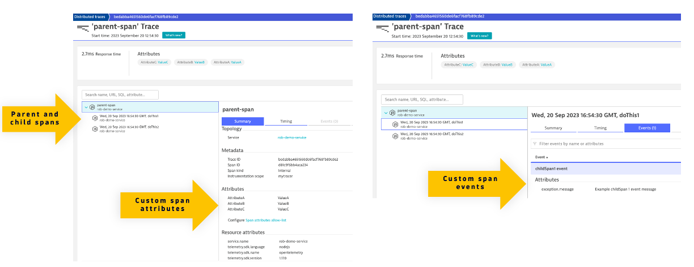
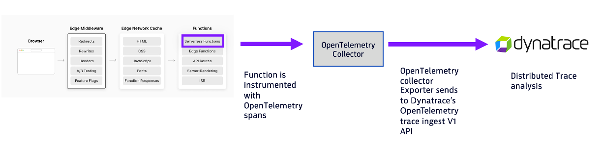

# Node.js Hello World

Simple Node.js + Vercel example that returns a "Hello World" response extended from the [Vercel sample App](https://github.com/vercel/examples/tree/main/solutions/node-hello-world) to include OpenTelemetry tracing. This guide shows how to send traces to Dynatrace via an OpenTelemetry collector.



# OpenTelemetry Setup

Vercel provides an OpenTelemetry collector, but to test locally or using a OpenTelemetry Collector on a VM, follow this guide.



## OpenTelemetry Collector Setup

This option uses the [OpenTelemetry Collector Binary](https://github.com/open-telemetry/opentelemetry-collector).  Do this locally or on a dedicated VM.  

If running on a VM, then expose as public IP and port `4318`

1. Download OpenTelemetry Collector Binary

    ```
    wget https://github.com/open-telemetry/opentelemetry-collector-releases/releases/download/v0.78.0/otelcol_0.78.0_linux_amd64.tar.gz
    ```

1. Create Dynatrace API Token with V2 `Ingest logs` scope

1. From this repo, copy and adjust `config.yaml` with the Dynatrace Log ingest v2 endpoint and access token

    ```
    otlphttp:
        endpoint: https://abc12345.live.dynatrace.com/api/v2/otlp
        headers:
        Authorization: "Api-Token dt0c01.sample.secret"
      ```

1. Start The Collector

    ```
    ./otelcol --config config.yaml
    ```

## OpenTelemetry Project Setup - Locally

Add a file called `.env.local` with either of the following.

Local OpenTelemetry Collector
```
EXPORTER_URL=http://localhost:4318/v1/traces
```

Remote OpenTelemetry Collector on a VM
```
EXPORTER_URL=http://W.X.Y.Z:4318/v1/traces
```

## OpenTelemetry Project Setup within Vercel

When running in Vercel, goto the project settings.  Under environment variables, add one called `EXPORTER_URL` with the Remote VM endpoint.

## Running locally

1. Install the Vercel CLI:

    ```bash
    npm i -g vercel
    ```

1. Clone this repo and follow the steps from the `OpenTelemetry Project Setup` section above

1. Then run the app at the root of the repository:

    ```bash
    vercel dev
    ```

1. Send in in request and you should see `{"message":"Hello Dynatrace User!"}` as the response

    ```bash
    curl http://localhost:3000/api/hello && echo ""
    ```

1. Verify traces being received in the OpenTelemetry logs

1. Verify traces are viewable in the Dynatrace distribute traces page


# Reference

* https://nextjs.org/docs/pages/building-your-application/optimizing/open-telemetry
* https://www.dynatrace.com/support/help/extend-dynatrace/opentelemetry/basics/opent-otlp 